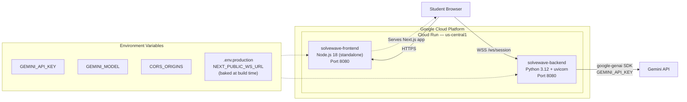
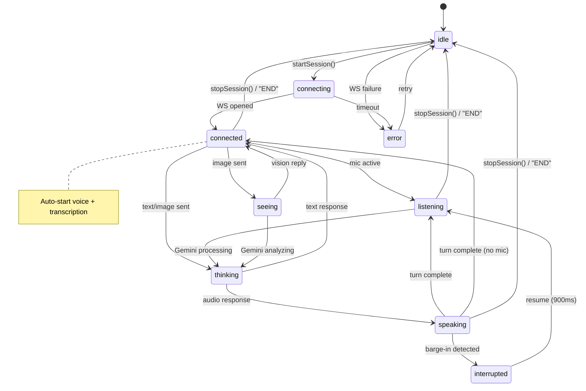
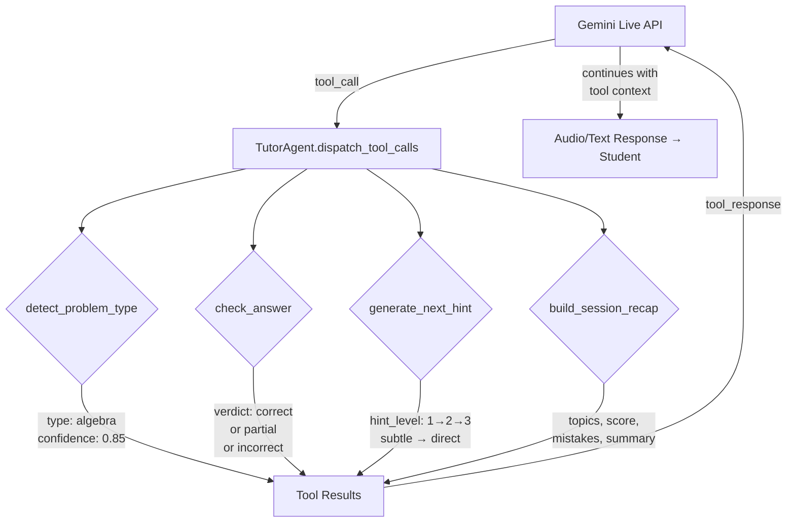
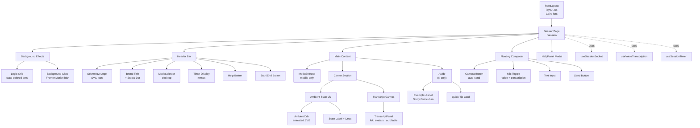
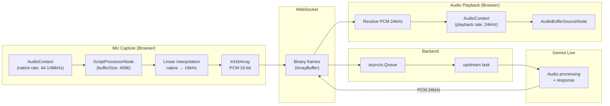

# SolveWave — Architecture (Mermaid) v0.5.1

## System Overview

```mermaid
graph TB
    subgraph Student["Student"]
        MIC["Microphone"]
        SPK["Speaker"]
        KB["Keyboard"]
        CAM["Camera"]
    end

    subgraph Browser["Browser — Next.js 14 + Framer Motion (Cloud Run)"]
        subgraph UI["React Components"]
            LOGO[SolveWaveLogo]
            MS[ModeSelector<br/>Explain / Quiz / Homework]
            ORB[AmbientOrb<br/>Animated SVG state viz]
            TP[TranscriptPanel<br/>F/U avatars]
            EP[ExamplesPanel<br/>Study Curriculum]
            COMP[Floating Composer<br/>Camera · Mic · Text · Send]
            TIMER[Session Timer<br/>mm:ss]
            HELP[HelpPanel<br/>Modal overlay]
        end

        subgraph Hooks["Core Hooks"]
            USS[useSessionSocket<br/>WebSocket + Audio + State]
            UVT[useVoiceTranscription<br/>Web Speech API]
            UST[useSessionTimer]
        end

        subgraph WebAudio["Web Audio API"]
            MCAP[Mic Capture<br/>native rate → 16kHz<br/>linear interpolation]
            PLAY[Audio Playback<br/>24kHz PCM mono]
        end
    end

    subgraph Backend["Backend — FastAPI (Cloud Run)"]
        subgraph API["main.py"]
            HEALTH["GET /health"]
            WSEP["WS /ws/session"]
        end

        subgraph SM["session_manager.py"]
            RL[receive_loop<br/>Browser → Queue]
            AQ[(asyncio.Queue)]
            MR[Mode Router<br/>+ addendum injection]
        end

        subgraph LC["live_client.py — Gemini Bridge"]
            UP[upstream<br/>Queue → Gemini]
            DN[downstream<br/>Gemini → Browser]
            GTR[generate_text_reply<br/>multi-turn chat]
            GIR[generate_image_reply<br/>multimodal vision]
        end

        subgraph Agent["tutor_agent.py"]
            SP[System Prompt<br/>system_prompt.md]
            TD[Tool Dispatcher]
        end

        subgraph Tools["Math Tools"]
            T1[detect_problem_type<br/>keyword classification]
            T2[check_answer<br/>verdict: correct/partial/incorrect]
            T3[generate_next_hint<br/>3 escalation levels]
            T4[build_session_recap<br/>topics · score · summary]
        end
    end

    subgraph Gemini["Gemini API (Google Cloud)"]
        LIVE["gemini-2.5-flash-native-audio<br/>Real-time audio streaming<br/>Full-duplex · Barge-in · Tools<br/>Voice: Charon"]
        TEXT["gemini-2.5-flash<br/>Text + Vision<br/>Multi-turn · Multimodal"]
    end

    %% Student <-> Browser
    MIC -->|audio| MCAP
    PLAY -->|audio| SPK
    KB -->|text| COMP
    CAM -->|"auto-capture"| COMP

    %% UI <-> Hooks
    COMP --> USS
    MS --> USS
    USS --> TP
    USS --> ORB
    UVT -.->|"partial/final transcripts"| TP
    UVT -.->|"final → sendTextQuiet"| USS
    UST --> TIMER

    %% Hooks <-> Web Audio
    USS --> MCAP
    USS --> PLAY

    %% Browser <-> Backend (WebSocket)
    MCAP -->|"binary: PCM 16kHz"| WSEP
    USS -->|"JSON: text/image/END"| WSEP
    WSEP -->|"binary: PCM 24kHz"| PLAY
    WSEP -->|"JSON: message/status/recap"| USS

    %% Backend internal
    WSEP --> RL
    RL -->|binary| AQ
    RL -->|"JSON text"| MR
    MR --> GTR
    MR -->|"JSON image"| GIR
    AQ --> UP

    %% Backend <-> Gemini
    UP -->|"realtime audio stream"| LIVE
    LIVE -->|"audio + tool_calls"| DN
    DN -->|"binary audio"| WSEP
    DN -->|"tool_call"| TD
    TD --> T1 & T2 & T3 & T4
    TD -->|"tool_response"| LIVE

    GTR -->|"text request + history"| TEXT
    TEXT -->|"text reply"| GTR
    GIR -->|"image + caption"| TEXT
    TEXT -->|"vision reply"| GIR

    %% Agent config
    SP -->|system instruction| LIVE
    SP -->|system instruction| TEXT

    %% Styling
    classDef browser fill:#1e293b,stroke:#3b82f6,color:#e2e8f0
    classDef backend fill:#1e293b,stroke:#10b981,color:#e2e8f0
    classDef gemini fill:#1e293b,stroke:#f59e0b,color:#e2e8f0
    classDef student fill:#1e293b,stroke:#8b5cf6,color:#e2e8f0

    class Browser browser
    class Backend backend
    class Gemini gemini
    class Student student
```

---

## WebSocket Message Protocol

```mermaid
sequenceDiagram
    participant S as Student
    participant B as Browser
    participant BE as Backend
    participant G as Gemini API

    Note over B,BE: WebSocket: /ws/session

    S->>B: Click "Start Tutoring"
    B->>BE: Open WebSocket
    BE-->>B: {"type":"status","value":"connected","session_id":"uuid"}
    Note over B: Auto-start voice + transcription

    rect rgb(30, 58, 95)
        Note over S,G: Voice Path (Real-time Audio + Dual Response)
        S->>B: Speaks into mic
        B->>B: Web Speech API transcribes locally
        B->>BE: Binary: PCM 16kHz chunks (resampled)
        B->>BE: JSON: sendTextQuiet(transcript, mode)
        BE->>G: Gemini Live stream (audio)
        BE->>G: generate_text_reply(transcript)
        G-->>BE: Audio response PCM 24kHz
        G-->>BE: Text response
        BE-->>B: Binary: PCM 24kHz chunks
        BE-->>B: {"type":"message","role":"tutor","text":"..."}
        B-->>S: Plays audio + shows text
    end

    rect rgb(30, 75, 58)
        Note over S,G: Text Path
        S->>B: Types message + clicks Send
        B->>BE: {"type":"text","text":"...","mode":"explain"}
        BE->>G: generate_text_reply()
        G-->>BE: Text response
        BE-->>B: {"type":"message","role":"tutor","text":"..."}
    end

    rect rgb(75, 58, 30)
        Note over S,G: Camera Path (Auto-Send Vision)
        S->>B: Taps Camera → captures photo
        B->>B: Auto-send (no staging step)
        B->>BE: {"type":"image","mimeType":"...","data":"base64"}
        BE->>G: generate_image_reply()
        G-->>BE: Vision analysis response
        BE-->>B: {"type":"message","role":"tutor","text":"..."}
    end

    rect rgb(75, 30, 58)
        Note over S,G: Barge-in (Interruption)
        S->>B: Speaks while tutor talking
        B->>BE: Binary: mic audio
        BE->>G: Audio stream continues
        G-->>BE: Interruption signal
        BE-->>B: {"type":"status","value":"interrupted"}
    end

    rect rgb(58, 30, 75)
        Note over S,G: Tool Call Flow
        G->>BE: tool_call: check_answer(...)
        BE->>BE: dispatch → local tool
        BE->>G: tool_response: {"verdict":"correct"}
        G-->>BE: Tutor audio/text with tool context
    end

    S->>B: Click "End Session"
    B->>BE: "END"
    BE->>BE: build_session_recap()
    BE-->>B: {"type":"recap","data":{...}}
    BE-->>B: Close WebSocket
```

---

## Deployment Architecture

---

## Live State Machine

---

## Tool Call Flow

---

## Frontend Component Tree

---

## Audio Pipeline (v0.5.0)

---

*Last updated: 2026-03-04 (v0.5.1)*
